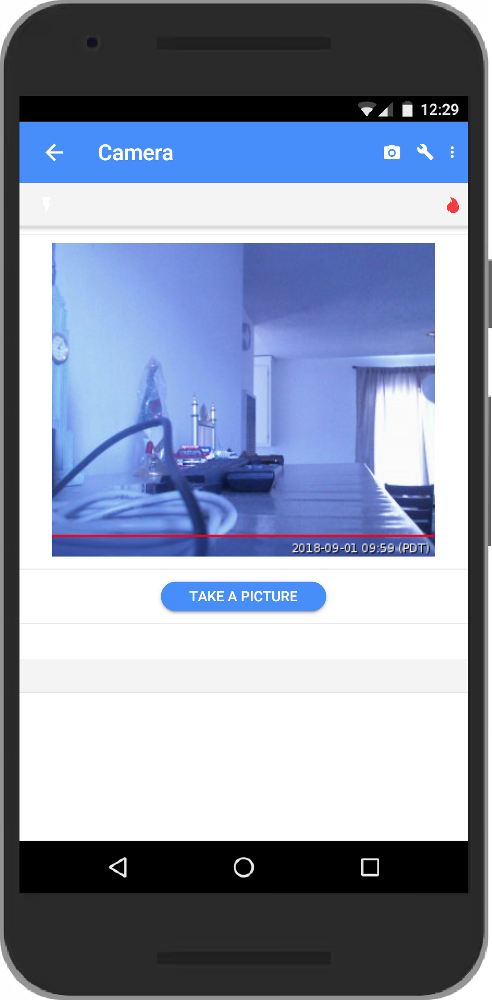
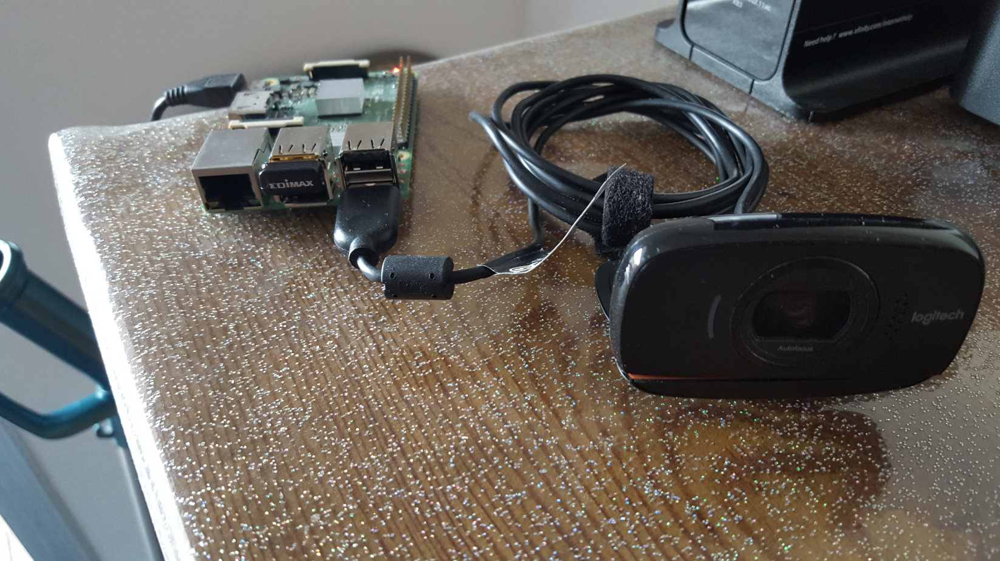
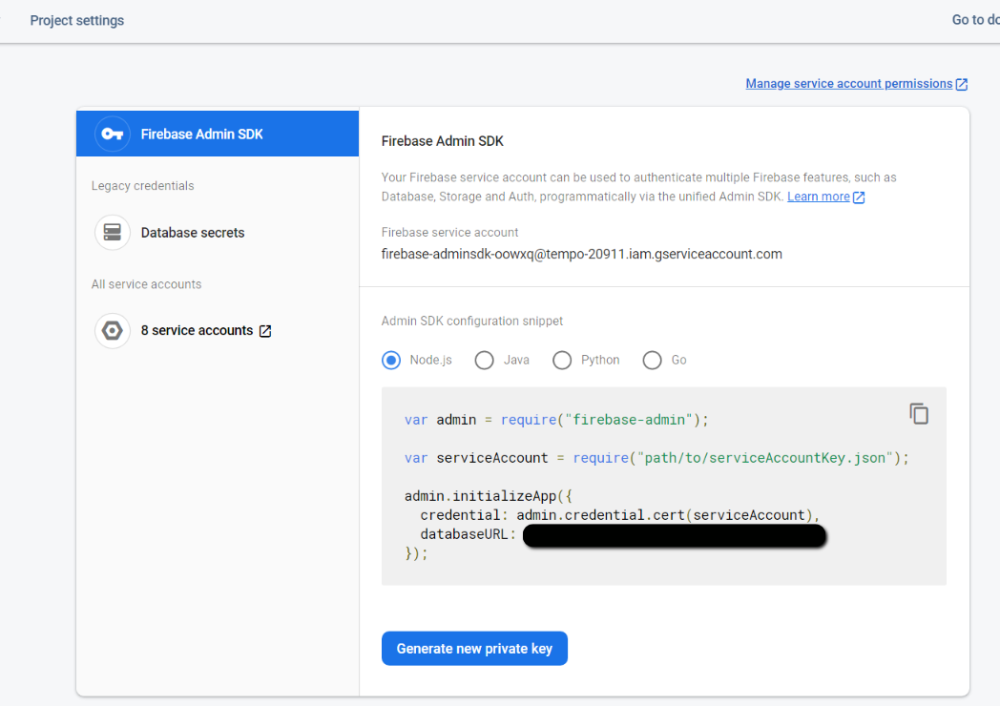

<h1 style="color:#1589F0;">Demo Project</h1>
In this project you will use the Gui Maker mobile app to 
control a remote webcam

Find the guide to the Gui Maker here: https://guimaker.app

<!--  -->
&nbsp;&nbsp;&nbsp;

&nbsp;&nbsp;&nbsp;&nbsp;&nbsp;&nbsp;



## Project name: Display a picture to your dashboard
Read the project details first here: https://guimaker.pro/demoprojects 

## Project setup
First download the project to your pc, next
1. Copy your database config to the firebase-config.json file
2. Edit the key-filename.json
3. Edit the environment variables in dash.env
4. Copy the project folde to your Raspbery Pi
5. SSH to your Raspberry Pi and run the setup.sh script to complete the setup

## 1 Copy the Firebase database config to firebase-config.json
- Log in to your Firebase console
- Go to Project Settings, then scroll down
- Copy the key-value pairs along with the curly brackets to the the firebase-config.json

Note: setup.sh will wrap the keys with double quotes to make the firebase-config.json a valid json file
 
## 2 Edit the key-filename.json file
This file is required for uploading pictures/images to the cloud storage
- In the Firebase console go to Project Settings > Service accounts > Firebase Admin SDK. 
- Scroll down then click on the "Generate new private key"
- Copy the download to the key-filename.json file located under the app folder



## 3 Edit dash.env
Complete or edit the values for:
- EMAIL=
- PASSWORD=
- DASHBOARD_NAME=

- CAMERA_BUTTON_LABEL="Take Picture"
- PICTURE_NAME=app/picture.jpg
- KEY_FILENAME=app/key-filename.json

- STORAGE_PICTURE_NAME=images/doorpic.jpg
- STORAGE_BUCKET= 
- METADATA=image/jpg
- FIREBASE_CONFIG=firebase-config.json

BUCKET_NAME is the value of "storageBucket" found in the firebase-config.json file

## 4 Copy the project folder to your raspberry Pi
Let's say:
- Your project name is "camera"
- The destination folder on the Pi is /home/pi
- The Pi ip address is 10.0.0.30
  
Run:  ``` scp -r camera pi@10.0.0.30:/home/pi ```

## 5 Run the setup.sh script to complete the setup
SSH to the raspberry, cd to your project folder then run:
bash setup.sh

The script will:
- Set the project name to the project folder name
- Set the project description
- Install fswebcam
- Install the dependencies
- Add executable permissions to dash.js
- Add the project folder path to dash.env
- Rename the following files to:
  - dash.js        > camera.js
  - dash.env       > camera.env
  - dash.service   > camera.service

- Replace 'dash' with the project folder name (camera) in package.json, package-lock.json 
  - "name": "dash" 
  - "main": "dash.js"

- Wrap the firebase-config.json keys with double quotes

- Configure the camera.service file by updating the following:
  - project description
  - path2dash.js
  - dash-identifier
  - user-name
  - path2dash.env

- Move camera.service file to the /etc/systemd/system folder
- Enable the camera service to start at boot time
- Start the camera service
- Check the camera service status
 
## Troubleshoot the setup
Check that the path and filenames are correctly spelled in:
  - camera.env
  - camera.service

Keep in mind that dashboard names created in the mobile app are case sensitive